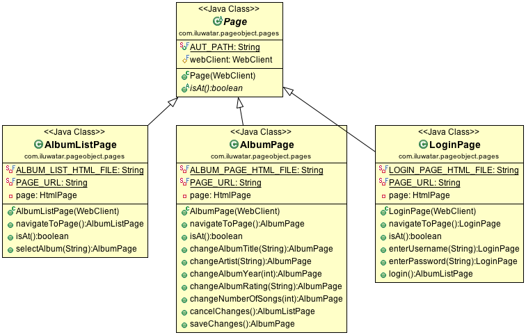

# Patrón de objetos de página en Java

## Ejemplo del mundo real

Considera un escenario de automatización web donde necesitas interactuar con una página web usando un framework de pruebas como Selenium. El patrón Page Object puede aplicarse para modelar cada página web como una clase Java. Cada clase encapsula la estructura y el comportamiento de la página web correspondiente, facilitando la gestión y actualización del código de automatización.

## Intención

Page Object encapsula la interfaz de usuario, ocultando el widget de interfaz de usuario subyacente de una aplicación (normalmente una aplicación web) y proporcionando una API específica de la aplicación para permitir la manipulación de los componentes de interfaz de usuario necesarios para las pruebas. De este modo, permite a la clase de prueba centrarse en la lógica de la prueba.

## En pocas palabras

El patrón Page Object en Java es un patrón de diseño utilizado en la automatización de pruebas para representar páginas web como clases Java. Cada clase corresponde a una página web específica y contiene métodos para interactuar con los elementos de esa página. Este patrón mejora el mantenimiento y la legibilidad del código en las pruebas automatizadas.

## Wikipedia dice

Aunque no hay una entrada específica en Wikipedia para el patrón Page Object, se utiliza ampliamente en las pruebas de software, en particular en el contexto de la automatización de la interfaz de usuario. El patrón Page Object ayuda a abstraer los detalles de una página web, proporcionando una forma más limpia y fácil de mantener para interactuar con elementos web en pruebas automatizadas.

## Ejemplo programático

Vamos a crear un ejemplo programático simple del patrón Page Object para una página de login utilizando Selenium en Java:

```java
import org.openqa.selenium.By;
import org.openqa.selenium.WebDriver;
import org.openqa.selenium.WebElement;

public class LoginPage {
    private final WebDriver driver;

    // Web elements on the login page
    private final By usernameInput = By.id("username");
    private final By passwordInput = By.id("password");
    private final By loginButton = By.id("login-button");

    public LoginPage(WebDriver driver) {
        this.driver = driver;
    }

    // Methods to interact with the login page

    public void enterUsername(String username) {
        WebElement usernameElement = driver.findElement(usernameInput);
        usernameElement.sendKeys(username);
    }

    public void enterPassword(String password) {
        WebElement passwordElement = driver.findElement(passwordInput);
        passwordElement.sendKeys(password);
    }

    public void clickLoginButton() {
        WebElement loginButtonElement = driver.findElement(loginButton);
        loginButtonElement.click();
    }

    // Other methods specific to the login page if needed
}
```

En este ejemplo, la clase `LoginPage` representa la página de login de una aplicación web. Encapsula los elementos web de la página y proporciona métodos para interactuar con esos elementos. La instancia real de Selenium WebDriver se pasa al constructor, permitiendo a los métodos realizar acciones en la página web.

Este objeto de página se puede utilizar en scripts de prueba para interactuar con la página de inicio de sesión sin exponer los detalles de la estructura de la página en el código de prueba, lo que favorece el mantenimiento y la reutilización.

## Aplicabilidad

Utilice el patrón Page Object cuando

* Estás escribiendo pruebas automatizadas para tu aplicación web y quieres separar la manipulación de la interfaz de usuario necesaria para las pruebas de la lógica de prueba real.
* Haga sus pruebas menos frágiles, y más legibles y robustas.

## Otro ejemplo con diagrama de clases


## Créditos

* [Martin Fowler - PageObject](http://martinfowler.com/bliki/PageObject.html)
* [Selenium - Page Objects](https://github.com/SeleniumHQ/selenium/wiki/PageObjects)
