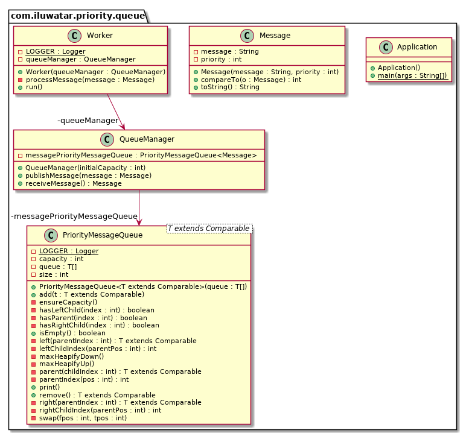

## Propósito
Priorizar las peticiones enviadas a los servicios de forma que las peticiones con mayor prioridad se reciban y procesen más rápidamente que las de menor prioridad. Este patrón es útil en aplicaciones que ofrecen diferentes garantías de nivel de servicio a clientes individuales.

## Explicación

Las aplicaciones pueden delegar tareas específicas en otros servicios; por ejemplo, para realizar procesamientos en segundo plano o para integrarse con otras aplicaciones o servicios. En la nube, se suele utilizar una cola de mensajes para delegar tareas al procesamiento en segundo plano. En muchos casos, el orden en que un servicio recibe las solicitudes no es importante. Sin embargo, en algunos casos puede ser necesario priorizar peticiones específicas. Estas peticiones deben ser procesadas antes que otras de menor prioridad que puedan haber sido enviadas previamente por la aplicación.

Ejemplo real

> Imagine un servicio de procesamiento de vídeo con clientes gratuitos y premium. Las solicitudes procedentes de los clientes premium de pago deben tener prioridad sobre las demás.

En pocas palabras

> La cola prioritaria permite procesar primero los mensajes de alta prioridad, independientemente del tamaño de la cola o de la antigüedad del mensaje.

Wikipedia dice

> En informática, una cola prioritaria es un tipo de datos abstracto similar a una cola normal o a una estructura de datos de pila en la que cada elemento tiene además una "prioridad" asociada. En una cola de prioridad, un elemento con prioridad alta se sirve antes que un elemento con prioridad baja.

**Ejemplo programático**

Si observamos el ejemplo anterior de procesamiento de vídeo, veamos primero la estructura `Message`.

```java
public class Message implements Comparable<Message> {

  private final String message;
  private final int priority; // define message priority in queue

  public Message(String message, int priority) {
    this.message = message;
    this.priority = priority;
  }

  @Override
  public int compareTo(Message o) {
    return priority - o.priority;
  }
  ...
}
```

Aquí está `PriorityMessageQueue` que se encarga de almacenar los mensajes y servirlos en orden de prioridad.

```java
public class PriorityMessageQueue<T extends Comparable> {

  ...

  public T remove() {
    if (isEmpty()) {
      return null;
    }

    final var root = queue[0];
    queue[0] = queue[size - 1];
    size--;
    maxHeapifyDown();
    return root;
  }

  public void add(T t) {
    ensureCapacity();
    queue[size] = t;
    size++;
    maxHeapifyUp();
  }

  ...
}
```

El `QueueManager` tiene una `PriorityMessageQueue` y facilita la publicación de mensajes `publishMessage` y la recepción de mensajes `receiveMessage`.

```java
public class QueueManager {

  private final PriorityMessageQueue<Message> messagePriorityMessageQueue;

  public QueueManager(int initialCapacity) {
    messagePriorityMessageQueue = new PriorityMessageQueue<>(new Message[initialCapacity]);
  }

  public void publishMessage(Message message) {
    messagePriorityMessageQueue.add(message);
  }

  public Message receiveMessage() {
    if (messagePriorityMessageQueue.isEmpty()) {
      return null;
    }
    return messagePriorityMessageQueue.remove();
  }
}
```

El `Worker` sondea constantemente el `QueueManager` en busca del mensaje de mayor prioridad y lo procesa.

```java
@Slf4j
public class Worker {

  private final QueueManager queueManager;

  public Worker(QueueManager queueManager) {
    this.queueManager = queueManager;
  }

  public void run() throws Exception {
    while (true) {
      var message = queueManager.receiveMessage();
      if (message == null) {
        LOGGER.info("No Message ... waiting");
        Thread.sleep(200);
      } else {
        processMessage(message);
      }
    }
  }

  private void processMessage(Message message) {
    LOGGER.info(message.toString());
  }
}
```

Aquí está el ejemplo completo de cómo creamos una instancia de `QueueManager` y procesamos mensajes usando `Worker`.

```java
    var queueManager = new QueueManager(100);

    for (var i = 0; i < 100; i++) {
      queueManager.publishMessage(new Message("Low Message Priority", 0));
    }

    for (var i = 0; i < 100; i++) {
      queueManager.publishMessage(new Message("High Message Priority", 1));
    }

    var worker = new Worker(queueManager);
    worker.run();
```

Salida del programa:

```
Message{message='High Message Priority', priority=1}
Message{message='High Message Priority', priority=1}
Message{message='High Message Priority', priority=1}
Message{message='High Message Priority', priority=1}
Message{message='High Message Priority', priority=1}
Message{message='High Message Priority', priority=1}
Message{message='High Message Priority', priority=1}
Message{message='High Message Priority', priority=1}
Message{message='High Message Priority', priority=1}
Message{message='High Message Priority', priority=1}
Message{message='Low Message Priority', priority=0}
Message{message='Low Message Priority', priority=0}
Message{message='Low Message Priority', priority=0}
Message{message='Low Message Priority', priority=0}
Message{message='Low Message Priority', priority=0}
Message{message='Low Message Priority', priority=0}
Message{message='Low Message Priority', priority=0}
Message{message='Low Message Priority', priority=0}
Message{message='Low Message Priority', priority=0}
Message{message='Low Message Priority', priority=0}
No Message ... waiting
No Message ... waiting
No Message ... waiting
```


## Diagrama de clases



## Aplicabilidad

Utilice el patrón de Cola Prioritaria cuando:

* El sistema debe manejar múltiples tareas que pueden tener diferentes prioridades.
* Diferentes usuarios o inquilinos deben ser atendidos con diferente prioridad.

## Créditos

* [Priority Queue pattern](https://docs.microsoft.com/en-us/azure/architecture/patterns/priority-queue)
