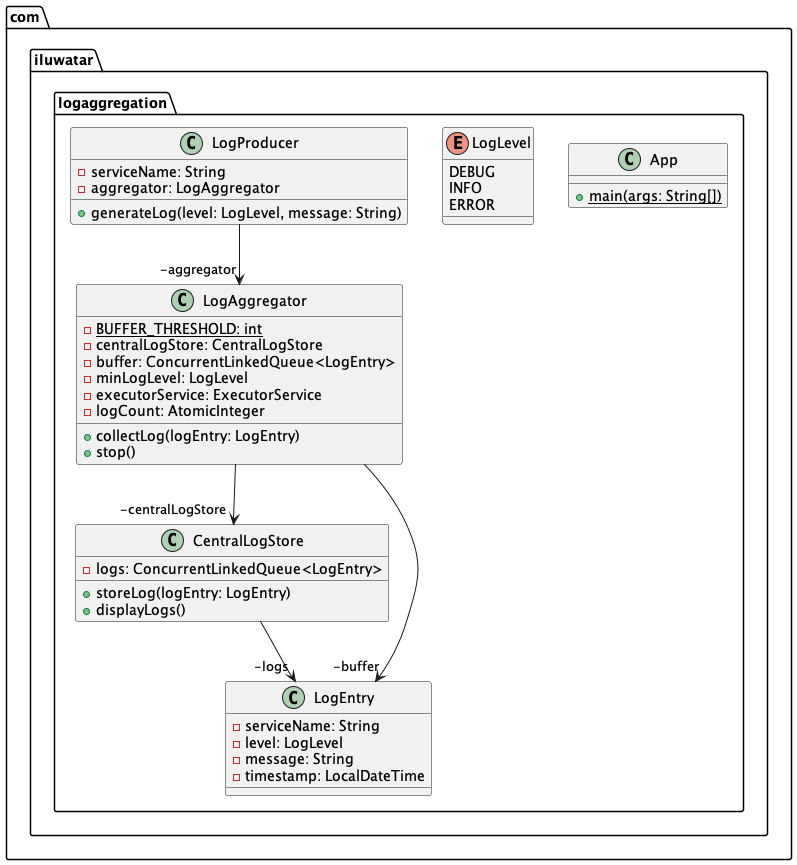

## Intent

Centralize, streamline, and optimize the process of log management so that insights can be quickly
derived, problems can be swiftly identified and resolved, and the system's overall health can be
monitored efficiently.

## Explanation

Real-world example

> AWS CloudWatch aggregates logs from various AWS services for monitoring and alerting.

In plain words

> The primary goal is to consolidate logs from different sources, making them more accessible and
> actionable. Various tools and platforms, such as Elasticsearch-Logstash-Kibana (ELK) stack,
> Splunk,
> Graylog, and others, are employed in these real-world scenarios to facilitate log aggregation.

Wikipedia says

> You have applied the Microservice architecture pattern. The application consists of multiple
> services and service instances that are running on multiple machines. Requests often span multiple
> service instances. Each service instance generates writes information about what it is doing to a
> log file in a standardized format. The log file contains errors, warnings, information and debug
> messages.

## Class diagram

## Applicability

1. Distributed Systems and Microservices
   - In modern architectures where systems are split into smaller, independent microservices running across multiple servers or even data centers, aggregating logs from all these services is crucial for a holistic view of system health and activity. 
   
2. Troubleshooting and Debugging
   - When system failures or unexpected behaviors occur, engineers need consolidated logs to trace and diagnose issues. Log aggregation makes this process efficient by collecting all relevant logs in one place.

3. Security and Compliance Monitoring
   - Many industries have regulatory requirements for log retention and analysis. Log aggregation helps in collecting, retaining, and analyzing logs for unauthorized access, potential breaches, and other security threats.

4. Performance Monitoring
   - Aggregated logs can be used to identify performance bottlenecks, slow database queries, or service endpoints experiencing high latencies.

## Credits

* [Pattern: Log aggregation](https://microservices.io/patterns/observability/application-logging.html)
